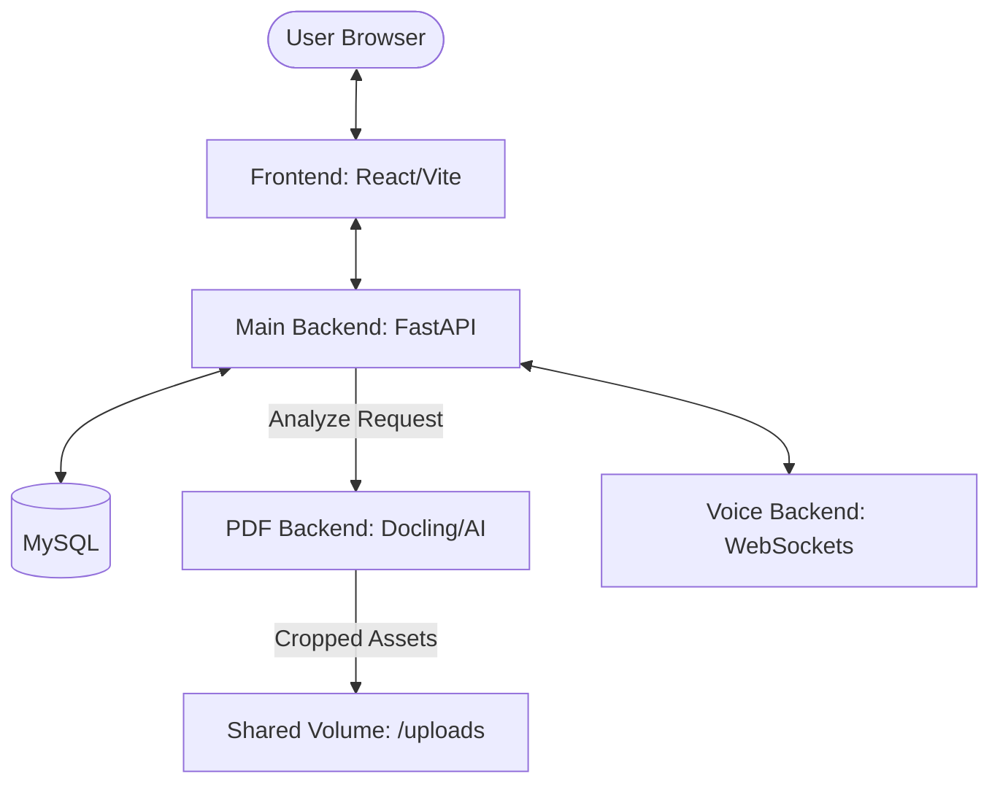

# 📔 StackNote (MSA & AI-Enhanced Edition)

**StackNote**는 단순한 문서 기록 도구를 넘어, AI가 복잡한 PDF 문서를 분석하고 이를 노션(Notion) 스타일의 스마트한 노트로 변환해 주는 **차세대 지식 관리 플랫폼**입니다. 마이크로서비스 아키텍처(MSA)를 기반으로 고성능 AI 처리와 실시간 협업을 동시에 실현합니다.

---

## 🌟 핵심 기능 (Key Features)

### 🧠 1. AI-Powered PDF Intelligence (Smart Parsing)
단순한 텍스트 추출이 아닌, 문서의 '의도'와 '구조'를 이해하는 AI 파이프라인을 탑재했습니다.
-   **Structure Recognition**: IBM Docling 엔진을 통해 헤더(H1-H3), 문단, 리스트, 표, 그림을 완벽하게 구분합니다.
-   **Visual Integrity (High-Precision Crop)**: 문서 내 이미지와 표를 300 DPI 고해상도로 정밀하게 도려내어 삽입함으로써, 텍스트로는 표현할 수 없는 시각적 맥락을 보존합니다.
-   **Header Elevation**: 논문이나 보고서의 'Abstract', 'Conclusion' 등 핵심 섹션을 자동으로 감지하여 에디터의 제목 블록으로 변환합니다.

### 🧩 2. Ultimate Notion-Style Editor
사용자의 가독성과 편집 경험을 극대화하기 위해 디자인된 블록 기반 에디터입니다.
-   **Hierarchical Indentation**: 제목 레벨에 따라 하위 블록들이 자동으로 들여쓰기되는 시각적 계층 구조를 제공하여 문서의 구조를 한눈에 파악할 수 있습니다.
-   **Pure Aesthetics**: 노션의 폰트 시스템과 여백 감각을 픽셀 단위로 적용했습니다. 특히 헤더 사이의 넓은 여백(Vertical Rhythm)은 장문의 문서에서도 최고의 가독성을 보장합니다.
-   **Smart Conflict Prevention**: 프로그램의 자동 업데이트와 사용자의 수동 편집이 충돌하지 않도록 설계된 고도화된 동기화 로직을 통해 소중한 데이터를 보호합니다.

### 🎙️ 3. Real-time Collaboration & Voice
팀원들과 함께 문서를 보며 실시간으로 소통할 수 있는 환경을 제공합니다.
-   **Voice Channels**: 가벼운 음성 채널을 통해 별도의 툴 없이도 즉각적인 협업이 가능합니다.
-   **Workspace Sync**: 조직과 팀 단위로 문서를 관리하고 권한을 공유할 수 있습니다.

---

## 🏗 기술 아키텍처 (Architecture)

본 프로젝트는 서비스간 부하 분산을 위해 독립적인 5개의 서비스로 구성된 MSA 구조를 취하고 있습니다.



---

## 📖 이용 가이드 (User Guide)

### 1단계: 로그인 및 워크스페이스 생성
-   이메일 주소로 간편하게 가입하고 나만의 개인 워크스페이스를 만듭니다.
-   동료를 초대하여 함께 편집할 수도 있습니다.

### 2단계: PDF 업로드 (마법의 시작)
-   사이드바의 **[PDF 업로드]** 버튼을 통해 보유하신 PDF 파일을 올립니다.
-   수 초 내에 AI가 문서를 분석하며, 분석이 완료되면 **완벽하게 레이아웃이 복원된 새로운 페이지**가 생성됩니다.

### 3단계: 스마트 편집
-   이미지와 표는 이미 원본 그대로 배치되어 있습니다.
-   자동으로 생성된 헤더 계층을 따라 내용을 수정하거나, 새로운 블록을 추가하여 나만의 일지로 완성하세요.

---

## � 설치 및 실행 (Setup & Run)

시스템의 모든 구성 요소는 Docker를 통해 간편하게 실행할 수 있습니다.

1.  **환경 파일 설정**: 루트 디렉토리의 `.env` 파일을 확인합니다. (기본값 제공)
2.  **도커 기동**:
    ```bash
    docker-compose up --build
    ```
3.  **접속 정보**:
    -   **Frontend**: `http://localhost:8012`
    -   **API Server**: `http://localhost:8000`
    -   **API Docs**: `http://localhost:8000/docs`

---

## 📂 프로젝트 구조
-   **`backend/`**: 메인 비즈니스 로직 및 워크스페이스 관리
-   **`pdf-backend/`**: Docling AI 엔진 기반의 PDF 고도 분석 서비스
-   **`voice-backend/`**: 실시간 소통을 위한 소켓 서비스
-   **`shared/`**: 모든 서비스가 공유하는 핵심 모델 레이어
-   **`frontend/`**: React & BlockNote 기반의 유저 인터페이스

---

더 상세한 기술적 구현 방식이 궁금하시다면 [Technical Report](file:///Users/sonseog-u/Downloads/StackNote-b_feat-4/project_update_report.md.resolved)를 참조해 주세요.
