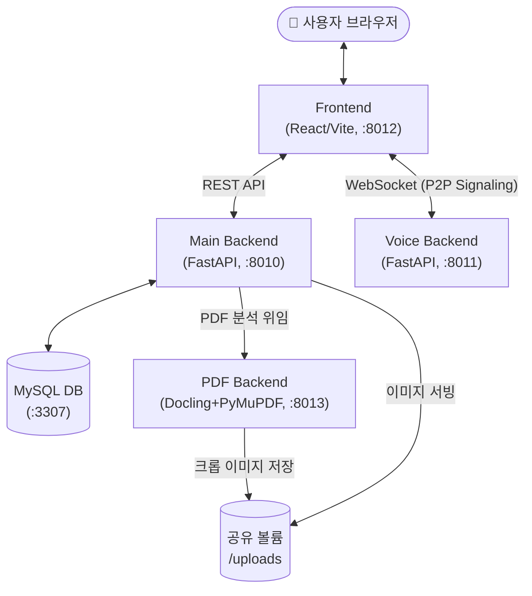

# 📔 StackNote

**StackNote**는 AI가 복잡한 PDF 문서를 분석하고, 이를 Notion 스타일의 블록 기반 에디터로 변환해 주는 **지식 관리 플랫폼**입니다.  
마이크로서비스 아키텍처(MSA)로 설계되어, 고성능 AI 처리와 실시간 음성 협업을 동시에 지원합니다.

> 🎓 본 프로젝트는 비상업적 교육용 포트폴리오 목적으로 제작되었습니다.

---

## 🌟 핵심 기능 (Key Features)

### 🧠 1. AI-Powered PDF 분석
단순한 텍스트 추출을 넘어 문서의 **구조와 시각적 맥락**을 분리·보존합니다.

- **레이아웃 구조 인식**: [IBM Docling](https://github.com/DS4SD/docling) 엔진으로 제목(H1~H6), 문단, 리스트, 표, 이미지를 자동 분류합니다.
- **300 DPI 고화질 이미지 크롭**: [PyMuPDF](https://pymupdf.readthedocs.io/) 기반으로 이미지·표 영역을 정밀하게 잘라내어 원본 시각 품질을 보존합니다.
- **헤더 자동 승격**: "Abstract", "Introduction", "결론" 등 핵심 섹션 키워드 및 패턴(숫자 목차 등)을 감지해 에디터 제목 블록으로 자동 변환합니다.
- **오버랩 노이즈 제거**: 이미지 영역과 겹치는 찌꺼기 텍스트를 BBox 교차 계산(50% 임계값)으로 자동 필터링합니다.
- **페이지 구분선 자동 삽입**: 페이지 전환마다 `Divider` 블록을 삽입해 문서 흐름을 시각적으로 구분합니다.

### 🧩 2. Notion 스타일 블록 에디터
[BlockNote](https://www.blocknotejs.org/) 라이브러리를 기반으로 한 리치 텍스트 편집 환경입니다.

- **지원 블록 타입**: `paragraph`, `heading` (H1~H6), `bulletListItem`, `numberedListItem`, `checkListItem`, `image`, `table`, `divider`
- **계층형 자동 들여쓰기**: 제목 레벨에 따라 하위 블록이 자동으로 중첩 구조로 재구성됩니다.
- **자동 저장**: 사용자 입력 후 1초 Debounce로 자동 저장되며, 페이지 이탈 시 미저장 변경사항을 강제 저장합니다.
- **저장 상태 표시**: `Saved to Cloud` / `Saving...` / `Unsaved Changes` 상태를 실시간으로 표시합니다.
- **이미지 업로드**: 슬래시(`/`) 메뉴를 통해 로컬 이미지 파일을 에디터 내에 직접 삽입할 수 있습니다.
- **30초 폴링**: 다른 기기에서의 변경사항을 30초마다 자동으로 동기화합니다. (미저장 상태에서는 건너뜀)

### 📁 3. 워크스페이스 & 페이지 관리
팀 단위의 문서 공간을 체계적으로 구성합니다.

- **회원 관리**: 이메일 기반 회원가입, 로그인, 계정 삭제 (소프트 삭제)
- **워크스페이스**: 회원 가입 시 기본 워크스페이스 자동 생성, 이름 수정, 삭제 지원
- **페이지**: 페이지 생성(중첩 포함), 이름/아이콘 수정, 삭제 (소프트 삭제)
- **멤버 초대**: 워크스페이스에 다른 사용자를 초대, 초대 수락/거절 관리
- **PDF → 페이지 변환**: PDF 업로드 시 AI 분석 결과를 새 페이지로 자동 생성

### 🎙️ 4. 실시간 음성 채널
[WebRTC](https://webrtc.org/) P2P 방식의 음성 통화를 지원합니다.

- **WebSocket 시그널링 서버**: Offer/Answer/ICE Candidate 교환을 중계합니다.
- **다중 참가자 지원**: 방(room) 기반으로 여러 사용자가 동시에 접속할 수 있습니다.
- **입장/퇴장 이벤트**: 실시간으로 참가자 변동을 모든 채널 멤버에게 알립니다.

---

## 🏗 기술 스택 (Tech Stack)

### 서비스별 기술 스택

| 서비스 | 주요 기술 |
|---|---|
| **Frontend** | React 19, Vite, TypeScript, BlockNote, axios, Socket.IO Client |
| **Backend (Main)** | Python, FastAPI, SQLAlchemy 2.0, Pydantic v2, MySQL 8.4, PyMySQL |
| **PDF Backend** | Python, FastAPI, Docling (IBM), PyMuPDF (fitz) |
| **Voice Backend** | Python, FastAPI, WebSocket (WebRTC Signaling) |
| **Infra** | Docker, Docker Compose, MySQL 8.4 |

---

## 🏛 아키텍처 (Architecture)

총 5개의 독립 마이크로서비스로 구성됩니다.


```mermaid
graph TD
    User([👤 사용자 브라우저]) <--> FE["Frontend\n(React/Vite, :8012)"]
    FE <-- "REST API" --> BE["Main Backend\n(FastAPI, :8010)"]
    FE <-- "WebSocket (P2P Signaling)" --> VO["Voice Backend\n(FastAPI, :8011)"]
    BE <--> DB[("MySQL DB\n(:3307)")]
    BE -- "PDF 분석 위임" --> PDF["PDF Backend\n(Docling+PyMuPDF, :8013)"]
    PDF -- "크롭 이미지 저장" --> VOL[("공유 볼륨\n/uploads")]
    BE -- "이미지 서빙" --> VOL
```

### 포트 정보

| 서비스 | 외부 포트 | 컨테이너 포트 |
|---|---|---|
| Frontend | `8012` | `5173` |
| Main Backend | `8010` | `8000` |
| Voice Backend | `8011` | `8000` |
| PDF Backend | `8013` | `8000` |
| MySQL DB | `3307` | `3306` |

---

## 📂 프로젝트 구조

```
StackNote/
├── frontend/        # React + BlockNote 기반 UI
├── backend/         # 메인 비즈니스 로직 (사용자, 워크스페이스, 블록 API)
├── pdf-backend/     # Docling + PyMuPDF 기반 PDF 분석 서비스
├── voice-backend/   # WebRTC P2P 시그널링 서버
├── shared/          # DB 모델, Pydantic 스키마 (서비스 간 공유)
└── docker-compose.yml
```

---

## 🚀 설치 및 실행 (Setup & Run)

### 사전 준비
- [Docker Desktop](https://www.docker.com/products/docker-desktop/) 설치 필요

### 환경 변수 설정

루트 디렉토리의 `.env` 파일을 확인 및 수정합니다.

```env
# .env 예시
DB_PASSWORD=your_mysql_password
DB_NAME=stacknote
```

### 실행

```bash
# 전체 서비스 빌드 및 기동
docker-compose up --build

# 백그라운드 실행
docker-compose up --build -d
```

### 접속 정보

| 항목 | URL |
|---|---|
| **서비스 화면** | http://localhost:8012 |
| **API 문서 (Swagger)** | http://localhost:8010/docs |
| **PDF 백엔드 문서** | http://localhost:8013/docs |

---

## 📄 오픈소스 라이선스

본 프로젝트는 다음 오픈소스 라이브러리를 사용합니다.

| 라이브러리 | 라이선스 | 용도 |
|---|---|---|
| [FastAPI](https://fastapi.tiangolo.com/) | MIT | 백엔드 API 프레임워크 |
| [SQLAlchemy](https://www.sqlalchemy.org/) | MIT | ORM |
| [Pydantic](https://docs.pydantic.dev/) | MIT | 데이터 검증 |
| [bcrypt](https://pypi.org/project/bcrypt/) | Apache-2.0 | 비밀번호 해싱 (미래 적용 예정) |
| [React](https://react.dev/) | MIT | 프론트엔드 UI 라이브러리 |
| [BlockNote](https://www.blocknotejs.org/) | MPL-2.0 | 블록 기반 에디터 |
| [Vite](https://vitejs.dev/) | MIT | 프론트엔드 빌드 도구 |
| [Docling](https://github.com/DS4SD/docling) | MIT | PDF 레이아웃 분석 AI |
| [PyMuPDF (fitz)](https://pymupdf.readthedocs.io/) | **AGPL-3.0** | PDF 고화질 이미지 크롭 |
| [Uvicorn](https://www.uvicorn.org/) | BSD | ASGI 서버 |

### PyMuPDF (AGPL-3.0) 이용 안내

`PyMuPDF`는 AGPL-3.0 라이선스를 따릅니다.  
본 프로젝트는 **비상업적·교육용 포트폴리오**로 소스코드를 GitHub에 전부 공개하고 있으므로, AGPL의 소스코드 공개 의무를 충족합니다.

> 만약 이 코드를 기반으로 **상업용 비공개 서비스**를 운영하려는 경우,  
> [Artifex의 상용 라이선스](https://www.artifex.com/licensing/)를 구매하거나, `PyMuPDF`를 MIT/BSD 계열 라이브러리로 교체해야 합니다.

---

## 📝 본 프로젝트 라이선스

```
MIT License

Copyright (c) 2025 StackNote Contributors

Permission is hereby granted, free of charge, to any person obtaining a copy
of this software and associated documentation files (the "Software"), to deal
in the Software without restriction, including without limitation the rights
to use, copy, modify, merge, publish, distribute, sublicense, and/or sell
copies of the Software, and to permit persons to whom the Software is
furnished to do so, subject to the following conditions:

The above copyright notice and this permission notice shall be included in all
copies or substantial portions of the Software.

THE SOFTWARE IS PROVIDED "AS IS", WITHOUT WARRANTY OF ANY KIND, EXPRESS OR
IMPLIED, INCLUDING BUT NOT LIMITED TO THE WARRANTIES OF MERCHANTABILITY,
FITNESS FOR A PARTICULAR PURPOSE AND NONINFRINGEMENT. IN NO EVENT SHALL THE
AUTHORS OR COPYRIGHT HOLDERS BE LIABLE FOR ANY CLAIM, DAMAGES OR OTHER
LIABILITY, WHETHER IN AN ACTION OF CONTRACT, TORT OR OTHERWISE, ARISING FROM,
OUT OF OR IN CONNECTION WITH THE SOFTWARE OR THE USE OR OTHER DEALINGS IN THE
SOFTWARE.
```

> ⚠️ 단, 본 프로젝트 내 `pdf-backend` 컴포넌트는 AGPL-3.0 라이선스의 `PyMuPDF`를 사용하므로,  
> 해당 컴포넌트에 대해서는 AGPL-3.0 조건이 우선 적용될 수 있습니다.
